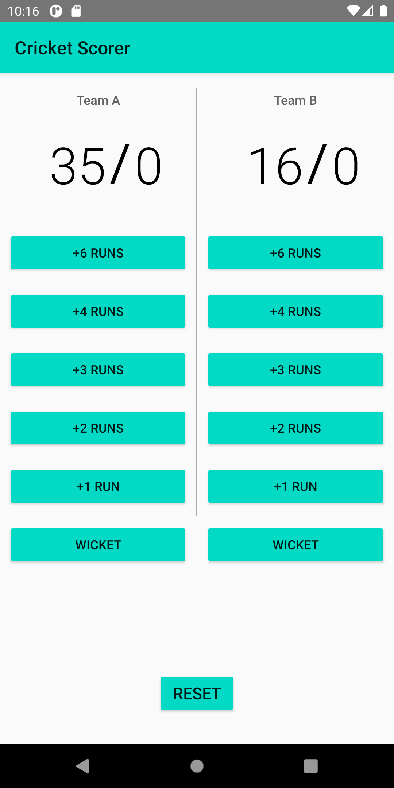

# Score-keeper-App
Udacity Android Basics Nanodegree Project No. 2: Score-keeper-App

# Project Details
Design and implement a Score keeper app that counts the score of a cricket game as per your requirenment.

# Layout Screen

